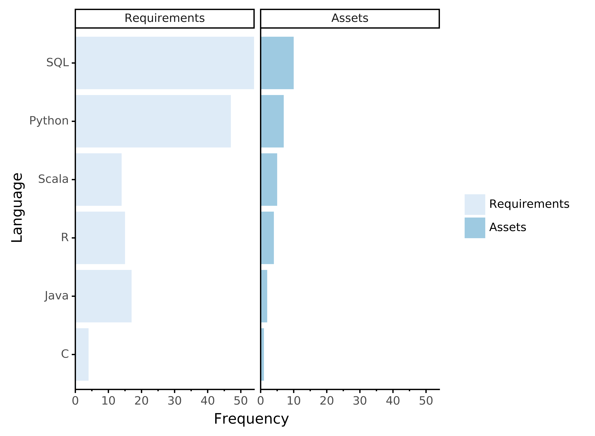

I recently read an article by Hanif Samad where he flipped his hiring question on its head. Instead of looking for what companies wanted in their job postings, he wanted to know what data scientists in Singapore had done before they were hired for their current position? As a person hoping to enter this field, I am interested going back to the basic of what companies are looking for for their data scientists today in the city I live in: Vancouver.

Want to read the full article? Check it our here on [Medium](https://towardsdatascience.com/vancouvers-data-scientist-market-24c43307d784).

