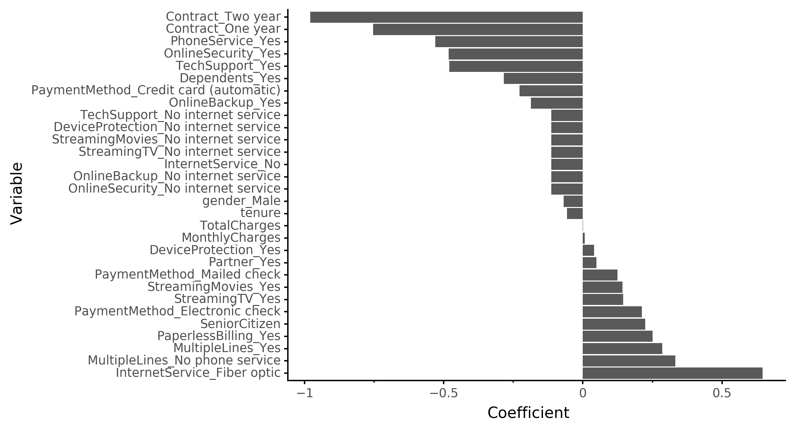
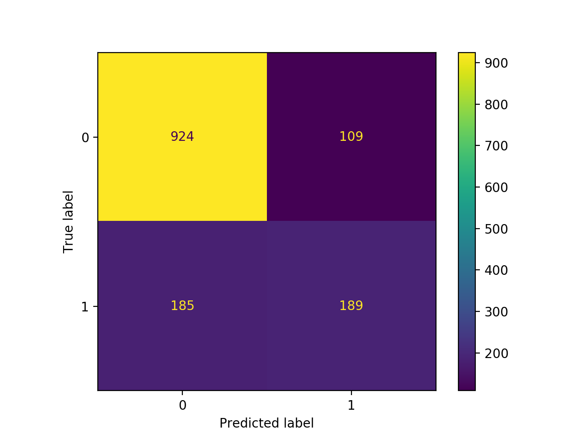

**Coefficient Strength from Logistic Regression Model**  
**Updated:**  

I came back to this a bit later than I hoped to but made some additional progress. I did some more hyperparameter tuning with additional models, and switched from optimizing on accuracy to F1 score. This is a better metric for this problem because we are really concern with identifying those that might churn with high likelihood. If we wanted to make this even stronger we could put some extra penalty in the scoring function for false negatives. Let's go into this idea a bit more. 

We can see the importance of this visually with a confusion matrix:

In the confusion matrix, the numbers in the top left and bottom right are the ones we are predicting correctly. The bottom left are ones we predicted would stay with the company but are actually about to leave. The top right are customers that we think are going to leave, but are actually going to stay. However, it is worse for us (probably) to predict someone is going to stay and they end up leaving, than for us to incorrectly identify someone who is going to stay as someone who is going to leave. Therefore, our priority should be shrinking the number in the bottom left (false negatives) over the top right (false positives). 

Say we took 1000 customers as an example. Of those 1000, we would expect around 270 to leave our company soon. We want to identify these 270 so that we can intervene to hopefully convince them to stay. Our current model can identify about half of these 270 (135) as those that will likely leave. Unforuntately, that means we're missing about 135 customers that should have some follow-up to convince them to stay. Adding in greater penalization for these false positives could help us shrink this 135 so that we can keep these customers on board.  

Other improvements:
- I added some nice colours to the final model's coefficient plot above. 
- Additional models like XGBClassifier
- Hyperparameter implementation

**Original post:**  
Just a quick post after a half day project today.  

I started the day by downloading a dataset on customer churn from Kaggle:
https://www.kaggle.com/blastchar/telco-customer-churn

  
I was able to test out some different models (logistic regression, random forest, neural net) and will get to the hyperparameter optimization on a later day. 
  
Random Forest and SVM are **SEVERLY** overfitting to the training data. 

| Model type          | train_error |   test_error |
|---------------------|-------------|--------------|
| dummy (stratified)  | 0.3826      |   0.403      |
| Logistic regression | 0.1935      |   0.2068     |
| RBF SVM             | 0.0704      |   0.2281     |
| random forest       | 0.0145      |   0.2161     |
| neural net          | 0.192       |   0.2104     |

   
After that, I made a quick visual for the interepretation side of the results (see above). It's not helpful to predict churn if we can't do anything about it, or know what to do about it. Clearly, customers in long-term contracts (1-2 years) are highly unlikely to leave. I'm not sure what the connection between Fibre Optic Internet and Churn is but there is definitely some strong correlations here. Would be interesting to look into this more another day.

You can find my ongoing work on this mini-project  [here](https://github.com/timcashion/churn_analysis). 

Challenges to further improvements:
- The dataset is fairly limited on who the customers are. Other personal features (employment type, age, etc.) would help in prediction of churn here

