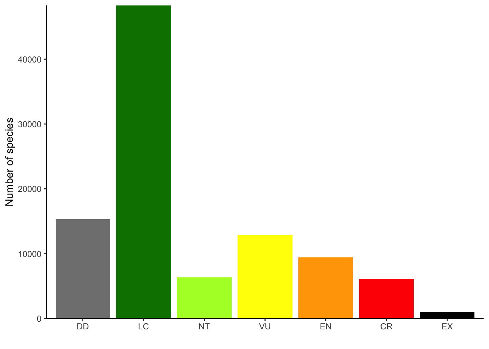

  
Make your plots with the official colours used by the IUCN according to their style guide.  

I wanted to give a bit more on the package I made for using IUCN palette colours in in R. I built this as I wanted to do just that, align the data I was representing with the official colours of the IUCN. The framework for the package was the Wes Anderson (package)[https://github.com/karthik/wesanderson] which made this fairly simple for me. I built some additional features to it though as people would be more likely to need only select colours. 

The additional features are passed as arguments to the main function 'iucn_palette' where you can exclude certain colours (exclude the colour for 'Extinct' for example), or where you can select to just use one (select only 'Endangered'). 

The names follow the IUCN two-letter codes and can be retrieved by `names(iucn_palettes)`

Practically, if you're only using one this isn't that different from putting the hexcode yourself, but the package does allow you to easily switch between them and access these colours when you need. 

I used this to make a simple graphic in [another post](https://timcashion.github.io/iucn_classifier/) as well. 
  

You can find the source code for the package [here](https://github.com/timcashion/IUCNpalette). 

